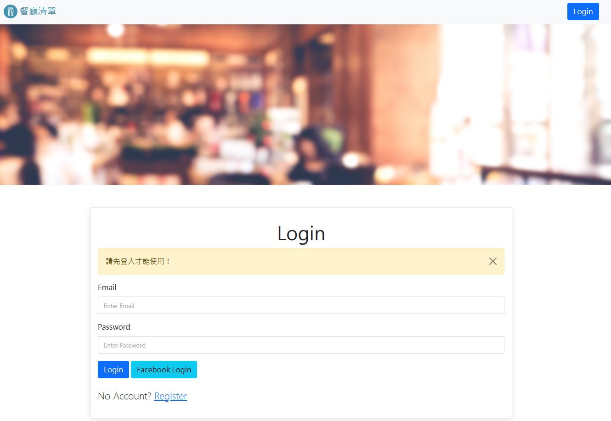

# 我的餐廳清單

## 介紹
記錄自己的餐廳清單，可以編輯、新增、刪除、查看詳細資訊



### 功能
1. 瀏覽所有餐廳
2. 瀏覽餐廳詳細資訊
3. 新增餐廳
4. 搜尋餐廳
5. 搜尋時可排序餐廳
5. 編輯餐廳
6. 刪除餐廳

## 環境建置
1. Node.js
2. Express 4.17.1
3. Express-Handlebars 5.3.3
4. mongoose 6.0.5

## Installing - 專案安裝
1. 將專案放到你的電腦，用終端機進入資料夾
2. 安裝 npm 套件
```
npm install
```

3. 設定環境變數，新建一個 .env 檔案，使用你的 MongoDB ，設定 MONGODB_URL 環境變數
```
MONGODB_URL=mongodb+srv://<username>:<password>@<cluster>.pk4dwnp.mongodb.net/?retryWrites=true&w=majority
```

4. 製作預設的八間餐廳資料
```
npm run seed
```

5. 啟動伺服器
```
npm run dev 
```

6. 當 terminal 出現以下字樣，表示伺服器已啟動並成功連結
```
App is running in http://localhost:3000
```
7. 打開瀏覽器輸入 http://localhost:3000 進入網頁

8. 使用 Ctrl + c 結束